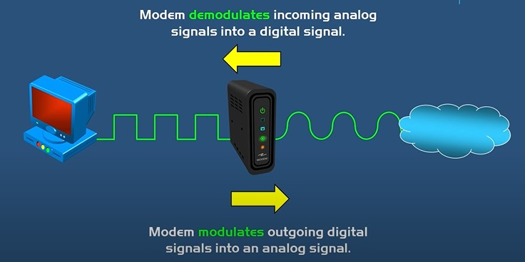
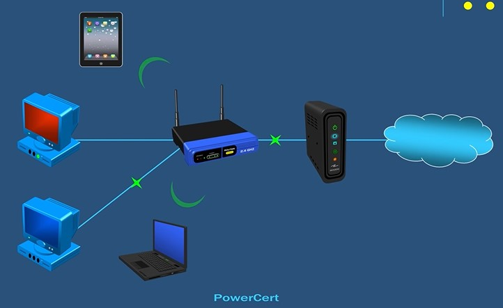
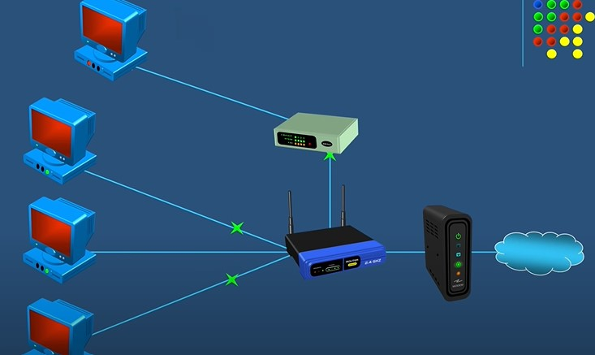

# modem
If you want internet inside your home or business, you have to have a **modem**.  
Modem is what brings the internet into your home or business.

There are two different type of signals that are used on a computer and the internet.
- Computer only reads **digtial signals**
- Internet only reads **analog signals**

modulating  : digital signals -> analog signals 
demodulating: analog signals -> digital signals  

# router 
Router is what **routes or passes** your internet connection to all of your devices in your home.  
we can just plug device's network cable into the modem, don't need the router device.
modem + router = modem router combination  
two primary functions:
- managing traffic between these networks by forwarding data packets to their intended IP addresses.
- allowing multiple devices to use the same Internet connection.

# switch
For example a router like this may hve four port so can connect four Ethernet cables for your wired devices,
if you need more wired connection, we can connect a **switch** to router, and add more connection to switch.

# LAN (Local Area Network)
A LAN is a group of connected computing devices within a localized area that usually share a centralized Internet connection.

- Ethernet LAN
LAN is a group of devices such as computer, servers, and printer which are located in the same building
# MAN (Matropolitan Area Network)
# WAN (Wide Area Network)
- Laegest type of network.  
- The ** internet** is an example of a WAN.
